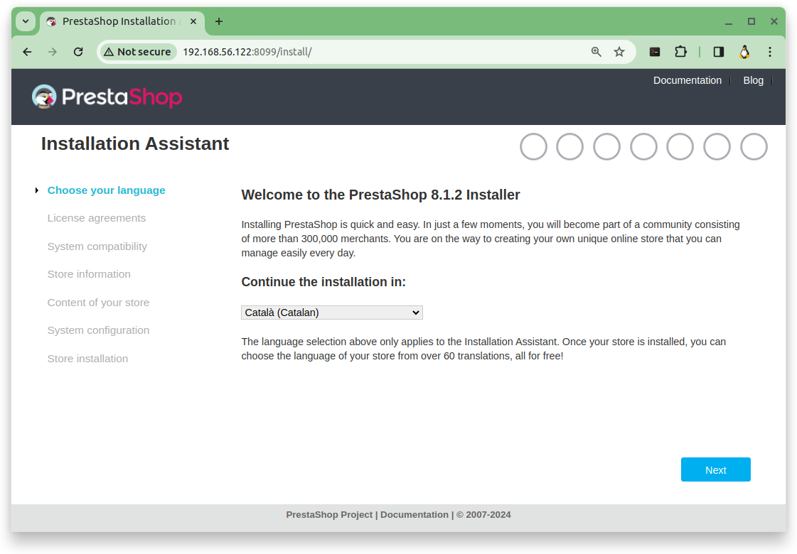
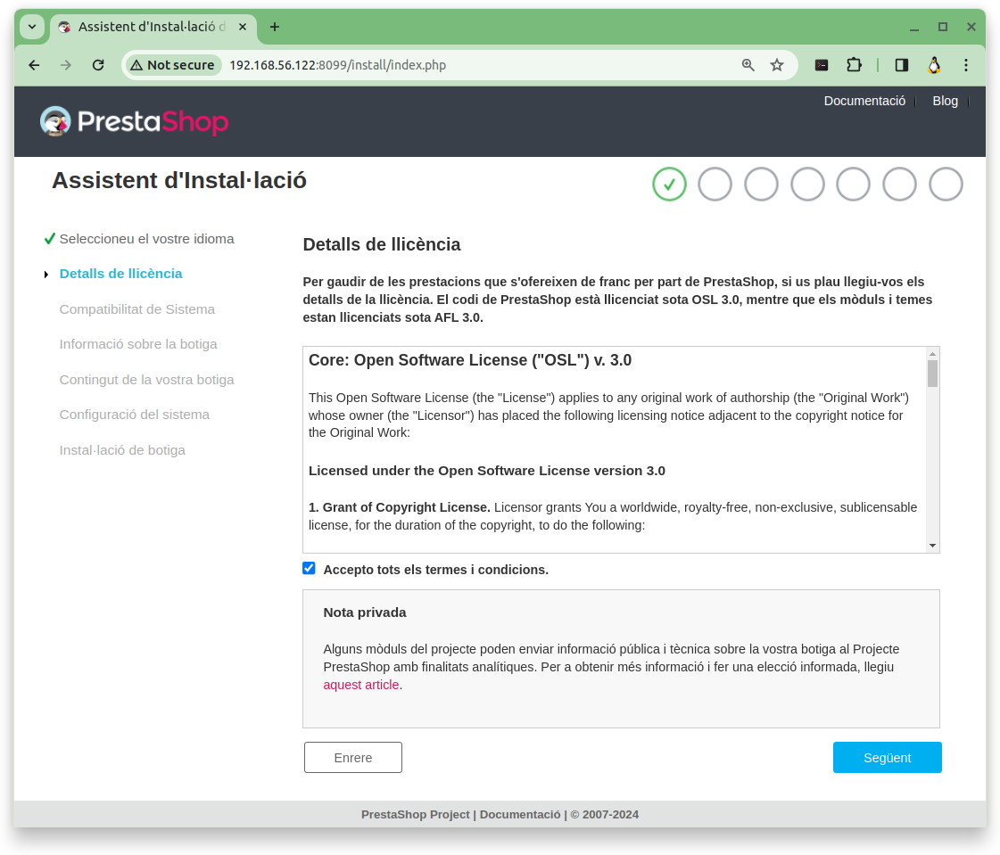
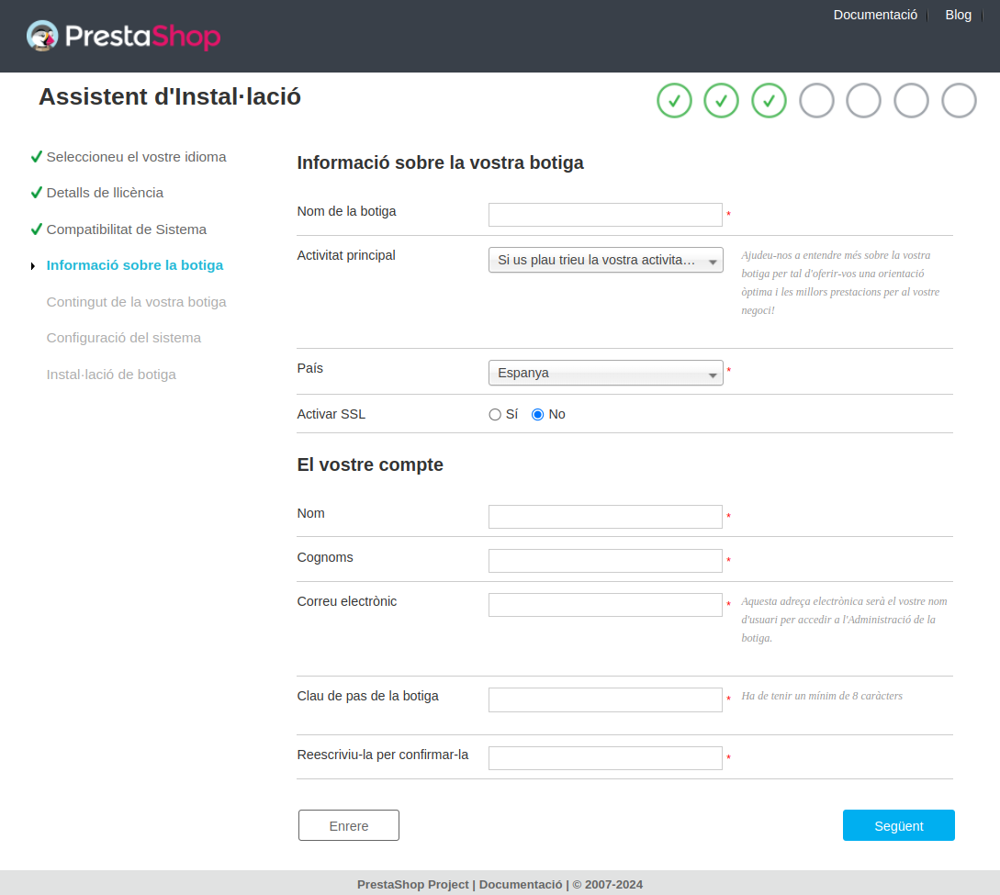

<!-- https://josejuansanchez.org/iaw/practica-prestashop-docker/index.html -->
 
# Activitat **```a10u```**: **```PrestaShop```** amb **```docker compose```**

**Objectiu**: Instal·lació de **```PrestaShop```** utilitzant els contenidors **```Docker Compose```**


## **Pas 1**: Creació de la carpeta que contindrà el sistema de contenidors.

* Comanda a executar:

```bash
sudo mkdir ~/c03-ps
cd ~/c03-ps
```

* Sortida:

<pre>
profe@docker-sxm:~$ sudo mkdir ~/c03-ps
cd ~/c03-ps
profe@docker-sxm:~/c03-ps$ 
</pre>

## **Pas 2**: Requisits de l'arxiu **```docker-compose.yml```**

### **2.1.** Imatges

Les imatges que farem servir són:

|Contenidor|Imatge|**```tag```**|
|---|---|---|
|**```prestashop```**|**```prestashop/prestashop```**|**```1.7```**|
|**```mysql```**|**```mysql```**|**```5.7```**|

* Comanda a executar:

```bash
sudo docker image list
```

* Sortida:

<pre>
profe@docker-sxm:~/c03-ps$ sudo docker image list
REPOSITORY                TAG            IMAGE ID       CREATED        SIZE
prestashop/prestashop     1.7            6e6ff1a2495e   2 hours ago    1.24GB
prestashop/prestashop     latest         9712f852ca81   3 months ago   1.42GB
prestashop/prestashop     1.7.8          fe5bfe08a491   4 months ago   1.24GB
...
mysql                     8              73246731c4b0   2 weeks ago    619MB
mysql                     5.7            bdba757bc933   2 months ago   501MB
...
profe@docker-sxm:~/c03-ps$ 
</pre>


> [!TIP]
> 
>Es pot mostrar la informació de les imatges segons un criteri de cerca.
>
>**Exemple 1**: si volem veure només aquelles imatges amb el **nom** **```prestashop/prestashop```**
>
>* Comanda a executar:
>
>```bash
>sudo docker image list --filter reference=prestashop/prestashop
>```
>
>* Sortida:
>
><pre>
>profe@docker-sxm:~/c03-ps$ sudo docker image list --filter reference=prestashop/prestashop
>REPOSITORY              TAG       IMAGE ID       CREATED        SIZE
>prestashop/prestashop   1.7       6e6ff1a2495e   2 hours ago    1.24GB
>prestashop/prestashop   latest    9712f852ca81   3 months ago   1.42GB
>prestashop/prestashop   1.7.8     fe5bfe08a491   4 months ago   1.24GB
>profe@docker-sxm:~/c03-ps$ 
></pre>
>
>**Exemple 2**: si volem veure només aquelles imatges amb el **nom** **```mysql```**
>
>* Comanda a executar:
>
>```bash
>sudo docker image list --filter reference=mysql
>```
>
>* Sortida:
>
><pre>
>profe@docker-sxm:~/c03-ps$ sudo docker image list --filter reference=mysql
>
>REPOSITORY   TAG       IMAGE ID       CREATED        SIZE
>mysql        8         73246731c4b0   2 weeks ago    619MB
>mysql        5.7       bdba757bc933   2 months ago   501MB
></pre>

### **2.2.** Ports

Només cal exposar el **```port```** **```8089```** del **host** i redirigir-lo al **```port```** **```80```** del contenidor amb el nom **```prestashop```**.

|Contenidor|Port del<br>host|Port del<br>contenidor|
|---|---|---|
|**```prestashop```**|**```8089```**|**```80```**|

### **2.3.** Volums

Els **volums definits** a l'arxiu **```docker-compose.yml```** hauran de ser el següents:

|Contenidor|carpeta<br>host|carpeta<br>contenidor|
|---|---|---|
|**```prestashop```**|**```./data```**|**```/var/www/html```**|
|**```mysql```**|**```./db```**|**```/var/lib/mysql```**|

### **2.4** Variables d'entorn

Cal fer servir un fitxer **```.env```** per emmagatzemar totes les variables de l'entorn necessaries a l'arxiu **```docker-compose.yml```**.

> [!TIP]
> A la documentació oficial podeu trobar més informació sobre com fer l'ús de variables d'entorn a l'arxiu **```docker-compose.yml```** [**Substituïu-lo amb un fitxer ```.env```**](https://docs.docker.com/compose/environment-variables/set-environment-variables/#compose-file)


### **2.5.** Polítiques de reinici de Docker

Caldrà fer ùs de la política de reinici per als dos contenidors per que es reiniciin cada vegada que es detenguin de forma inesperada.

> [!TIP]
> Es recomana consultar [la **documentació oficial** de l'opció **```restart```**](https://docs.docker.com/compose/compose-file/compose-file-v3/#restart).


<!--
### **2.4**  Ordre en el que s'inicien els **serveis**

Cal indicar l'ordre en el que s'ha d'iniciar els serveis amb l'opció **```depends_on```**.

> [!TIP]
> Se recomana la lectura de l'article [**Controla l'ordre d'inici i apagat a ```compose```** - Control startup and shutdown order in Compose](https://docs.docker.com/compose/startup-order/)

Per garantir que el servei de **```MySQL```** està llest per acceptar connexions, haurà d'utilitzar l'opció **```healthcheck```** de l'arxiu **```docker-compose.yml```**. 

> [!TIP]
> Es recomana la lectura de l'article [**```healthcheck```** - Compose file version 3 reference][https://docs.docker.com/compose/compose-file/compose-file-v3/#healthcheck].
-->

## **Pas 3**: Creació de l'arxiu **```docker-compose.yml```** usant la imatge **```prestashop/prestashop```**

A continuació es mostra una possible solució de la pràctica utilitzant la imatge de **PrestaShop** **```prestashop/prestashop```**.

### **3.1** Creació del fitxer **```.env```** per guardar les **variables d'entorn**

* Comanda a executar:

```bash
sudo vi ~/c03-ps/.env
```

* Contingut de l'arxiu **```.env```** que conté la configuració personal del sistema de contenidors:

```yml
# Configuració de l'acces a la base de dades
MYSQL_DATABASE=pardodb
MYSQL_USER=usuarips
MYSQL_PASSWORD=motdepasps
MYSQL_ROOT_PASSWORD=motdepasroot
```

### **3.2** Creació del fitxer **```docker-compose.yml```** amb la configuració del sistema de contenidors

* Comanda a executar:

```bash
sudo vi ~/c03-ps/docker-compose.yml
```

* Contingut de l'arxiu **```docker-compose.yml```**:

```yml
version: "3.0"
services:
  prestashop:
    image: prestashop/prestashop
    volumes:
    - ./data:/var/www/html
    ports:
    - "8099:80"
    restart: always

  basedades:
    image: mysql:5.7
    volumes:
    - ./db:/var/lib/mysql
    environment:
    - MYSQL_DATABASE=pardodb
    - MYSQL_USER=usuarips
    - MYSQL_PASSWORD=motdepasps
    - MYSQL_ROOT_PASSWORD=motdepasroot
    restart: always
```

## **Pas 4**: Aturar i eliminar **TOTS els contenidors** que tenim al servidor

Primer veiem quins contenidors es troben tant en execució com aturats:

* Comanda a executar:

```bash
sudo docker container list -a
```

* Sortida:

<pre>
profe@docker-sxm:~/c03-ps$ sudo docker container list -a
CONTAINER ID   IMAGE     COMMAND                  CREATED        STATUS                 PORTS                                   NAMES
7cbb7c33f024   nginx     "/docker-entrypoint.…"   4 weeks ago    Exited (0) 4 weeks ago                                         joannginx2
bfd31bece05d   nginx     "/docker-entrypoint.…"   2 months ago   Up 2 months            0.0.0.0:8800->80/tcp, :::8800->80/tcp   joannginx
profe@docker-sxm:~/c03-ps$  
</pre>

Veiem que hi ha dos contenidors, un amb el nom **```joannginx2```** que està aturat i un altre amb el nom **```joannginx```** que està en execució.

Com hem vist la comanda **```docker container list```** ens mostra molta informació d'aquells contenidors que es troben en execució.

Amb el parametre **```-a```** (de **all** en anglès), ens mostra molta informació, també, dels contenidors que es troben aturats i el altre parametre **```-q```** (de **quit** **silenci** en anglès) que, en comptes de mostrar-nos molta informació, **només** ens mostra l'identificador dels contenidors.

Per tant, combinant aquests dos parametres tenim:

**```docker container list -aq```** **només** ens mostra l'identificador dels contenidors es troben en execució i **també**, dels contenidors que es troben aturats.
<pre>
profe@docker-sxm:~/c03-ps$ sudo docker container list -aq
7cbb7c33f024
bfd31bece05d
profe@docker-sxm:~/c03-ps$ 
</pre>

Per tant, si volem **aturar** una **llista de contenidors** cal executar la comanda **```docker container stop``` &lt;```llista dels ID's```>**

> [!WARNING]
> Per tant per poder **aturar** **TOTS els contenidors** que tenim al servidor, ja estiguin aturats o no, podem fer servir la comanda:
> **```sudo docker container stop $(sudo docker container stop -aq)```**
> * Comanda a executar:
> 
> ```bash
> sudo docker container stop $(sudo docker container list -aq)
> ```
> **```docker container list -aq```** **només** ens mostra l'identificador dels contenidors es troben en execució i **també**, dels contenidors que es troben aturats.
> <pre>
> profe@docker-sxm:~/c03-ps$ sudo docker container stop $(sudo docker container list -aq)
> 7cbb7c33f024
> bfd31bece05d
> profe@docker-sxm:~/c03-ps$ 
> </pre>

I per **eliminar** una **llista de contenidors** contenidor cal que aquest estigui aturat i cal executar la comanda **```docker container remove``` &lt;```llista dels ID's```>**

> [!WARNING]
> Per tant per **eliminar** **TOTS els contenidors** que tenim al servidor, que ja estiguin aturats, podem fer servir la comanda: **```sudo docker container remove $(sudo docker container list -aq)```**
>
> * Comanda a executar:
> 
> ```bash
> sudo docker container stop $(sudo docker container list -aq)
> ```
> **```docker container list -aq```** **només** ens mostra l'identificador dels contenidors es troben en execució i **també**, dels contenidors que es troben aturats.
> <pre>
> profe@docker-sxm:~/c03-ps$ sudo docker container remove $(sudo docker container list -aq)```**
> 7cbb7c33f024
> bfd31bece05d
> profe@docker-sxm:~/c03-ps$ 
> </pre>

Un cop  que ja tenim **TOTS els contenidors** del nostre servidor eliminats podem procedir a crear i executar el nostre sistema de contenidors.

## **Pas 5**: Creació del sistema de contenidors de **PrestaShop**

Per crear el sistema de contenidors **PrestaShop** comencem per confirmar que no hi ha cap contenidor al nostre servidor.

* Comanda a executar:

```bash
sudo docker container list -a
```

* Sortida:

<pre>
profe@docker-sxm:~/c03-ps$ sudo docker container list -a
CONTAINER ID   IMAGE     COMMAND   CREATED   STATUS    PORTS     NAMES
profe@docker-sxm:~/c03-ps$ 
</pre>

> [!IMPORTANT]
> Si la sortida no és aquesta, cal que torneu al [Pas 4: Aturar i eliminar **TOTS els contenidors** que tenim al servidor](#pas-4-aturar-i-eliminar-tots-els-contenidors-que-tenim-al-servidor)

Un cop ja hem confirmat que no hi cap contenidor al nostre servidor, podem procedir a crear el sistema de contenidors de **PrestaShop**.

Per crear el sistema de contenidors **PrestaShop** executarem la següent comanda des de la carpeta (**```~/c03-ps```**) que conté el sistema de contenidors.

* Comanda a executar:

```bash
cd ~/c03-ps
sudo docker compose up -d
```

* Sortida:

<pre>
profe@docker-sxm:~/c03-ps$ cd ~/c03-ps
sudo docker compose up -d
[+] Running 3/3
 ✔ Network c03-ps_default         Created  0.1s
 ✔ Container c03-ps-basedades-1   Started  0.2s 
 ✔ Container c03-ps-prestashop-1  Started  0.2s 
profe@docker-sxm:~/c03-ps$ 
</pre>

## **Pas 6**: Validació de que el sistema de contenidors de **PrestaShop** funciona correctament

### **6.1** Obtenir l'adreça IP del nostre host
 
* Comanda a executar:

```bash
ip a | grep 56
```

* Sortida:

<pre>
profe@docker-sxm:~/c03-ps$ ip a | grep 56
    inet 192.168.56.122/24 metric 100 brd 192.168.56.255 scope global dynamic enp0s8
profe@docker-sxm:~/c03-ps$ 
</pre>

**En el meu cas** l'adreça IP del meu host és **```192.168.56.122```**

### **6.2** Obrir amb el navegador l'adreça IP del nostre host

Per tant, cal que obri, **en el meu cas** un navegador amb l'adreça IP del meu host és **```192.168.56.122```** seguida per **```:8099```**, que és el port que hem redirigit.



> [!IMPORTANT]
> ## Un cop que heu arribat a aquest punt, no cal que, **de moment**, feu res més!

<!-- 
## **Pas 7**: Configuració de **PrestaShop**




 -->