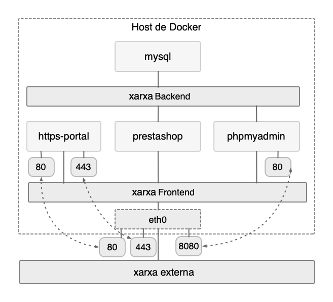

<!-- https://josejuansanchez.org/iaw/practica-prestashop-docker/index.html -->

# **```a10u```** Pràctica: **```PrestaShop```** amb **```docker compose```**

## Pas 1: Instal·lació de **```PrestaShop```** utilitzant els contenidors **```Docker Compose```**

### Requisits de l'arxiu **```docker-compose.yml```**

#### 1.2.1 Xarxes

Els **serveis definits** a l'arxiu **```docker-compose.yml```** hauran d'utilitzar dues xarxes:

* xarxa frontend (**```frontend-network```**)
* xarxa backend (**```backend-network```**)

A la **xarxa ```frontend-network```** estaran els serveis:

* **```https-portal```**,

* **```prestashop```** i

* **```phpmyadmin```**.

I a la **xarxa ```backend-network```** només estarà el servei:

* **```mysql```**

Només els serveis que estan a la xarxa **```frontend-network```** exposaran els seus ports a l'**```host```**. Per tant, el servei **```mysql```** no haurà d'estar accessible des de l'**```host```**.

A continuació es mostra un diagrama amb les xarxes i els serveis que té que crear:



#### Polítiques de reinici de Docker

Caldrà fer ùs d'alguna política de reinici per als contenidors que es reinicien cada vegada que es detenguin de forma inesperada.

> [!INFO]
>
> Es recomana consultar [la **documentació oficial** de l'opció **```restart```**](https://docs.docker.com/compose/compose-file/compose-file-v3/#restart).


#### Variables d'entorn

Cal fer servir un fitxer **```.env```** per emmagatzemar totes les variables de l'entorn necessaries a l'arxiu **```docker-compose.yml```**.

> ![INFO]
>
> A la documentació oficial podeu trobar més informació sobre com fer l'ús de variables d'entorn a l'arxiu **```docker-compose.yml```** [**Substituïu-lo amb un fitxer ```.env```**](https://docs.docker.com/compose/environment-variables/set-environment-variables/#compose-file)

